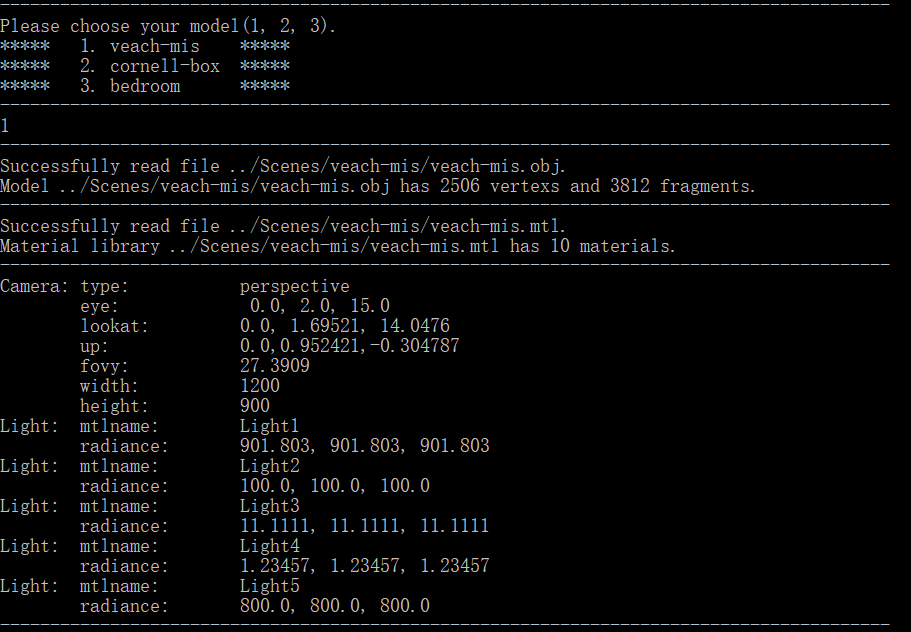

# Path Tracing Based on OpenGL(GLSL)

## 运行环境

- INVIDIA 1050Ti
- Visual Studio 2022
- GLFW3 + glad （OpenGL）

## 运行

直接点击根目录下的`.exe`文件就可以运行，测试在INVIDIA 1050Ti和3060上都可以正常运行。可以通过修改`./shader/fshader1.fs` 中的DL_SAMPLES参数设置BRDF采样光线条数，使用DEPTH参数设置光线追踪深度。

## 预处理

### 场景加载

场景加载主要使用了Model类，其中包含了并行建树和读取场景等操作。

- 对场景中的三角面片进行加载
- 对mtl材质库进行加载
- xml文件中的相机配置、视口大小和光源辐照度进行读取

### 加速结构

加速结构本打算使用CUDA并行构建的HLBVH，此处参考pbrt3，但后续由于时间关系没有做完，遂参考了pbrt3和https://github.com/AKGWSB/EzRT 项目中SAH线性加速结构的构建，因为此处要使用OpenGL的TBO纹理缓冲和GLSL通信。

- 一般的BVH加速结构

- 基于SAH的BVH加速结构

- 基于CUDA的HLBVH加速结构（TODO）

### 纹理图片加载

纹理加载主要使用了stb_image库，并使用GLSL的默认规范化将纹理的坐标空间映射到（0，1）中，最终使用材质的纹理坐标插值获取每一点的纹理颜色。

### 低差异序列

由于GLSL中没有实现随机数，但随机数序列对于采样影响巨大。如果同一条光线的各次采样中间产生奇怪的概率学依赖，就会产生很奇怪的bug，而且随机数序列的随机性会影响最后计算的收敛速度。此处尝试了两种低差异序列Hammersley和Sobol序列，最终使用了Sobal序列，使用的随机种子由点坐标和帧数来确定。

## 渲染管线

渲染管线主要参考了https://github.com/AKGWSB/EzRT 项目中的多帧混合做法，并结合https://learnopengl-cn.github.io/05%20Advanced%20Lighting/08%20Deferred%20Shading/ 中的延迟着色代码进行修改，设置片元着色器的纹理附件，在一个管线结束后通过纹理附件来保存一帧的数据，并在下一帧进行混合操作。流程图如下：

着色器类负责检查着色器的载入、GLSL数据和纹理的传输和编译错误检测等功能，实现来自于https://learnopengl-cn.github.io/ 。

## 渲染

### 重要性采样

重要性采样表现在对两种反射时候的出射光线方向的采样，并且应用不同采样策略时计算面积功率通量密度（PDF）的方式不同。

- 当以漫反射概率采样时，使用的采样策略是余弦加权的均匀半球采样。
- 当以镜面反射概率采样时，使用的是Disney的重要性采样。
### 直接对光源进行采样

由于场景是三角面片组成的，所以对光源的采样也是基于三角面片的，这里使用了面积PDF到立体角PDF的换算。并且在面光源上进行点的采样，结果可能并不如投影到法向半球之后均匀采样。同时，基于三角面片的采样会有一些问题，比如面光源太多（场景1）时会导致遍历次数过多，GLSL会崩溃，所以该场景只随机采样了一个三角面片光源。

### 间接光照

间接光照的重点在于BRDF中对于各个材质的处理，由于此处不考虑次表面反射，微表面反射和清漆效果等参数，针对镜面反射和漫反射进行建模，并根据两个反射的材质颜色进行加权混合，同时还根据菲涅尔方程进行颜色微调。此处参考了https://www.shadertoy.com/view/MsXfz4 的实现。

#### 漫反射

漫反射的计算很简单，只需要获取纹理颜色或者使用本身的颜色，以及对应漫反射的PDF就能计算。

#### 镜面反射

镜面反射的计算使用了Disney的BRDF对法线分布项，菲涅尔项和几何项的分别建模。使用的公式如下
$$
\frac{D\left(\theta_{h}\right) F\left(\theta_{d}\right) G\left(\theta_{l}, \theta_{v}\right)}{4 \cos \theta_{l} \cos \theta_{v}}
$$
再针对采样策略计算镜面反射的PDF，得到镜面反射项。

## 实验结果

### 场景一（测试镜面反射）

**结果分析：** 本来是要使用镜面反射的参数，利用Disney的公式做的，但是后面发现这里的反射光线颜色计算不需要这么复杂就能达到效果，所以这里只用了针对Ns参数的重要性采样部分内容。再者这个场景的直接光照采样很难控制，既不能全部采样，又要对结果进行平均。以及因为场景中的漫反射采样比例太低，在有限的采样次数较少，所以导致噪点很多。

### 场景二（测试漫反射）

**结果分析：** 整体效果还行，但收敛速度比较慢。

### 场景三（复杂场景加载和各种反射）

**结果分析：** 玻璃球灯泡调了好久，效果没有做出来，分析原因是天花板颜色太亮导致折射效果呈现不出来。

